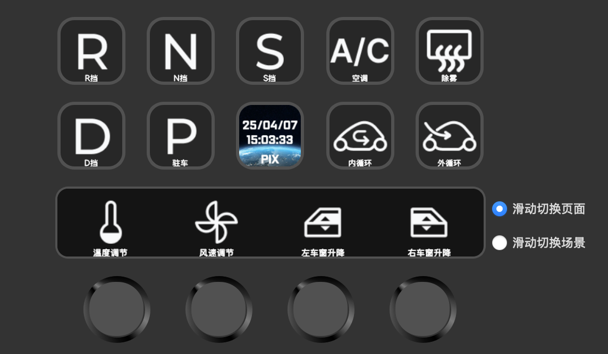
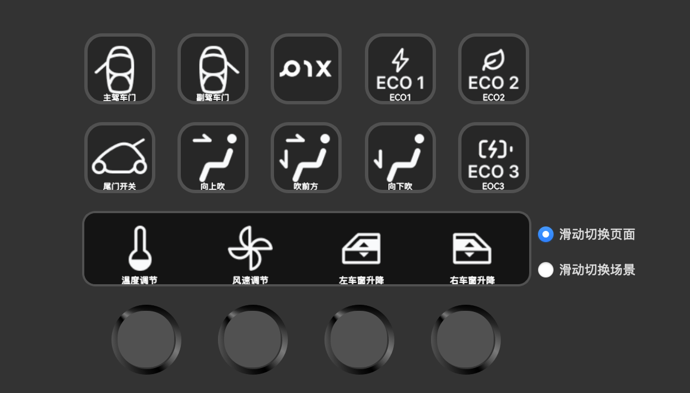
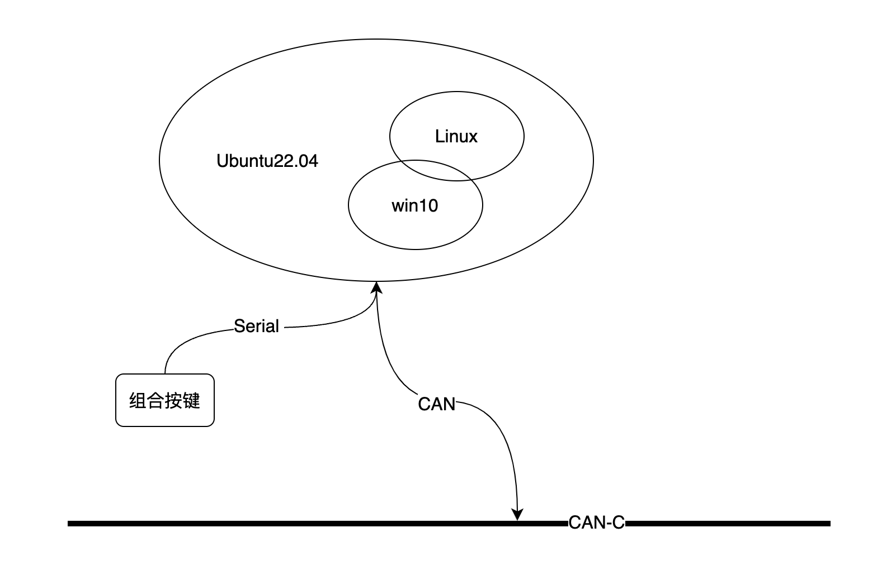

# NevSmartCockpit 功能介绍

### 这是通过或许宏键盘【中控仪表台按键】值来控制车辆的功能包
##### 客户端client.py 获取按键值通过网络发送到nev_driver_system.py服务器;服务器并通过ROS节点发送到ROS网络里;通过pix_nev_driver获取到话题后转发到ros2_socketcan,最后ros2_socketcan发送CAN报文到CAN总线进行汽车控制。

### 准备工作：
安装EMUC-B202-Driver

    https://github.com/pixmoving-moveit/EMUC-B202-Driver.git

    https://github.com/SilaLiu/nev_server_interface.git

    https://github.com/autowarefoundation/ros2_socketcan.git

    文件结构：

                NevSmartCockpit
                ├── nev_driver
                │   ├── pix_nev_driver
                │   │   ├── CMakeLists.txt
                │   │   ├── include
                │   │   ├── launch
                │   │   ├── package.xml
                │   │   └── src
                │   └── pix_nev_driver_msgs
                │       ├── CMakeLists.txt
                │       ├── msg
                │       └── package.xml
                ├── nev_launch
                │   ├── CMakeLists.txt
                │   ├── launch
                │   │   ├── nev_components.launch.py
                │   │   └── nev_components.launch.xml
                │   └── package.xml
                ├── nev_server_interface
                │   ├── CMakeLists.txt
                │   ├── launch
                │   │   └── nev_server_interface_launch.xml
                │   ├── package.xml
                │   ├── README.md
                │   ├── scripts
                │   │   ├── client.py
                │   │   ├── control_publisher.py
                │   │   ├── feedback_subscriber.py
                │   │   ├── nev_driver_system.py
                │   │   └── server.py
                │   └── src
                │       ├── __init__.py
                │       └── nev_server_interface.py
                └── ros2_socketcan
                    ├── ros2_socketcan
                    │   ├── CHANGELOG.rst
                    │   ├── CMakeLists.txt
                    │   ├── CONTRIBUTING.md
                    │   ├── design
                    │   ├── include
                    │   ├── launch
                    │   ├── LICENSE
                    │   ├── package.xml
                    │   ├── src
                    │   └── test
                    └── ros2_socketcan_msgs
                        ├── CHANGELOG.rst
                        ├── CMakeLists.txt
                        ├── CONTRIBUTING.md
                        ├── LICENSE
                        ├── msg
                        └── package.xml